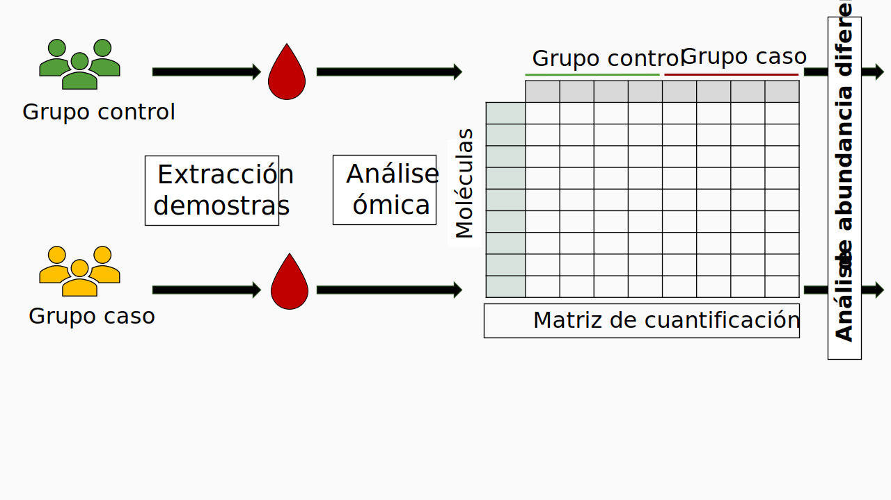
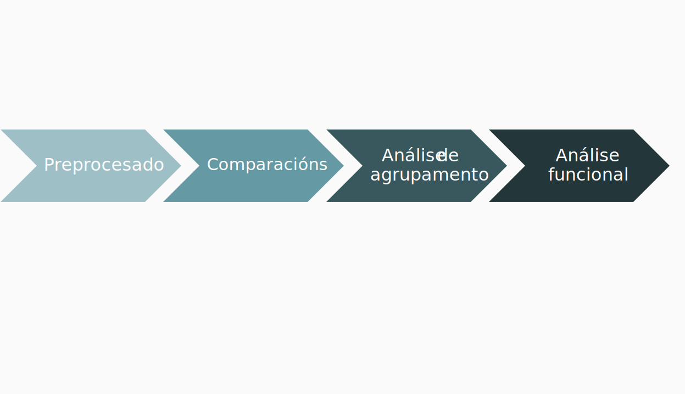

class: inverse, center, middle

```{css echo = F}
/* Evita que aparezca el cursor parpadeante en títulos o texto */

```

```{r echo = FALSE}
knitr::opts_chunk$set(
  eval = TRUE,
  echo = FALSE,
  message = FALSE,
  warning = FALSE,
  error = FALSE,
  include = TRUE,
  results = 'asis',
  fig.align = 'center',
  dev.args = list(bg = "transparent")
)
```

# Introdución

---


# As ómicas


<span style="font-size: 1.2em;">Nova disciplina en bioloxía que estuda, de maneira global e masiva, diferentes moléculas dun organismo.</span>

- Xéranse datos biolóxicos de grande dimensionalidade que requiren dunha **análise estatística**: **R software**.

- Tipos de moléculas e as súas correspondentes ómicas: 

--

```{r echo = F, out.width="90%", dev='svg', fig.align='center'}
knitr::include_graphics(path = "Figures/TypesOfOmics.svg")
```

---

# R e as ómicas

<span style="font-size: 1.2em;">Vantaxes do uso de R na análise de datos ómicos:</span>


* Software libre e gratuíto


* Ampla e activa comunidade de usuarios:

    * Desenvolvemento, mantemento e mellora constante dos diferentes paquetes de análise

--

* Estandarización e reproducibilidade de análises 

--

* Código aberto e compartido:

    * Transparencia
    
    * Flexibilidade

--

```{r echo = F, out.width="70%", dev='svg', fig.align='center'}
knitr::include_graphics(path = "Figures/bioconductor_2.svg")
```


---

class: inverse, center, middle

# Análise de abundancia diferencial

---

# Deseño experimental común en análise de abundancia diferencial




---

# Fluxo xeral na análise de abundancia diferencial





```{r echo = F, include = F, message = F, eval=require('dplyr')}
out <- readRDS(file = "DataExample/rawDataMatrix.rds")
dataMatrix <- out$dataMatrix
designMatrix <- out$designMatrix

df <- as.data.frame(table(designMatrix$Groups))
colnames(df) <- c("Grupo", "N")

library(dplyr)
library(ggplot2)

df <- df %>%
  mutate(
    Porcentaje = N / sum(N) * 100,
    etiqueta = paste0(Grupo, " (N=", N, ")"),
    ypos = cumsum(N) - 0.5*N
  )

df$Grupo <- factor(df$Grupo)
# plot sector
```

```{r include = F, echo=F}
ggplot(df, aes(x = "", y = N, fill = Grupo)) +
  geom_bar(width = 1, stat = "identity", color = "white") +
  coord_polar(theta = "y", ) +     # Esto lo convierte en pie chart
  geom_text(aes(y = ypos, label = etiqueta), color = "white", size = 8) +
  theme_void() + 
  theme(legend.position = "none") +
  scale_fill_manual(values = c("DM" = "#9EBFC6",
                               "NC" = "#23373B"))
```

---

# _Exemplo_

```{r echo = F, out.width="95%", dev='svg', fig.align='center'}
knitr::include_graphics(path = "Figures/DatosExmplo.svg")
```

.footnote[
<span style="font-size: 0.6em;">Amorim, M.; Martins, B.; Caramelo, F.; Gonçalves, C.; Trindade, G.; Simão, J.; Barreto, P.; Marques, I.; Leal, E. C.; Carvalho, E.; Reis, F.; Ribeiro-Rodrigues, T.; Girão, H.; Rodrigues-Santos, P.; Farinha, C.; Ambrósio, A. F.; Silva, R.; Fernandes, R. Putative Biomarkers in Tears for Diabetic Retinopathy Diagnosis. Front Med (Lausanne) 2022, 9, 873483. https://doi.org/10.3389/fmed.2022.873483.</span>
]
<!-- Dataset público do estudo [Chen et al., 2021](https://doi.org/10.3389/fnagi.2021.619945). -->

---

# Preprocesado

<br>

.pull-left[
1. **Transformación logarítima** da matriz de datos.

2. **Análise de datos faltantes**:

  * **Filtrado**: eliminación de moléculas con moitos valores faltantes. Recomendación: **filtrar por grupos**. 
  * **Imputación**: substitución de valores faltantes por valores estimados.

3. **Normalización** para reducir o erro sistemático presente nos datos.

]


.pull-rigth[

```{r echo = F, fig.height= 8, include = TRUE, dev='svg'}
knitr::include_graphics(path = "Figures/ImputNorm.svg")
```

]


---

# _Preprocesado (exemplo)_

```{r echo =F}
totalCell <- nrow(dataMatrix)*ncol(dataMatrix)
naDM <- dataMatrix %>% dplyr::select(dplyr::starts_with("T2DM_")) %>% is.na(.) %>% sum() 
totalCellDM <- nrow(dataMatrix)*22
totalCellNC <- nrow(dataMatrix)*21
naNC <- dataMatrix %>% dplyr::select(dplyr::starts_with("Control_")) %>% is.na(.) %>% sum() 
# image(!is.na(as.matrix(dataMatrix)), col = c("grey", "#23373B"),
#       axes = FALSE)
dfQuant <- out$normDataMatrix
# outGraphs <- readRDS(file = "DataExample/preprocessGraphs.rds")
grafico <- readRDS(file = "DataExample/preprocessGraphs_.rds")
```

.pull-left[
**Datos faltantes**: 
* Total: `r round((sum(is.na(dataMatrix))/totalCell)*100, 2)` %
* Grupo NC: `r round((naNC/totalCellNC)*100, 2)`% | Grupo DM: `r round((naDM/totalCellDM)*100, 2)`%
* **Filtro**: máximo 50% datos faltantes por grupo.

```{r out.width="80%", dev='svg', echo = FALSE}
knitr::include_graphics(path = "Figures/naHeatmap.svg")
```

> `r nrow(dfQuant)` proteínas de `r nrow(dataMatrix)` proteínas totais

]

--

.pull-right[

**Normalizacións:**

```{r echo = F, fig.align='center', fig.height=6.5, dev = "svg", background="transparent"}
grafico
```


```{r echo = F, include = F, dev = 'svg', fig.align='center', out.height="35%"}
# outGraphs$Norm
```

]


---

# Comparacións entre grupos

<br>

.pull-left[

1. **Comparación** da cantidade de cada molécula entre grupos.

2. **Corrección do p-valor** por comparacións múltiples:
    
3. Cálculo do $log_2$ _fold change_ ou $logFC$:

  $$log_2FC = log_2{(\frac{mean_{Case}(molecule_1)}{mean_{Control}(molecule_1)})}$$

4. Representación: gráfico de tipo volcán ou **volcano plot**.

]


.pull-right[

```{r echo = F, fig.align='center', out.height='70%', dev= "svg"}
knitr::include_graphics(path = "Figures/TablaDE.svg")
```

]


---

# _Comparacións entre grupos (exemplo)_

```{r echo = F}
dfRes <- readRDS(file = "DataExample/resultsDE.rds")
```

.pull-left[
Táboa de resultados:

```{r echo=F, dev='svg', out.width='80%', fig.align='center'}
df <- dfRes[c(1:2, 4:9),]
DT::datatable(df, extensions = "Buttons", rownames = F, escape = F,
              options = list(ordering = F, dom = "rt", scrollY = F,
                            scrollX = F, pageLength = nrow(df),
                            columnDefs = list(list(className = 'dt-center', targets = '_all')),
                            full_width = TRUE)) %>% 
DT::formatStyle(1, font = 'bold') %>% 
  DT::formatRound(3:6, digits = 2)
```
]


.pull-right[
Volcano plot (`EnhancedVolcano`):

```{r echo = F, dev="svg", include = T, fig.width=6}
EnhancedVolcano::EnhancedVolcano(
  toptable = dfRes, 
  lab = rownames(dfRes), 
  x = "logFC", 
  y = "P-valor",
  pCutoff = 0.05, 
  ylim = c(0, 3),
  xlim = c(-4, 4) 
) +
  theme(panel.background = element_rect(fill = "transparent", colour = NA),
    # Fondo del "papel" o lienzo (área fuera del panel)
    plot.background = element_rect(fill = "transparent", colour = NA),
    # Opcional: Si tienes leyendas y también quieres que sean transparentes
    legend.background = element_rect(fill = "transparent", colour = NA),
    legend.box.background = element_rect(fill = "transparent", colour = NA))
```

]

---

# Análise de agrupación

As moléculas con abundancia diferencial permiten discriminar entre os grupos de estudo no seu conxunto?

--

.pull-left[

* **Análise de compoñentes principais (PCA)**

```{r echo = F, fig.align='center', dev= "svg"}
knitr::include_graphics(path = "Figures/TablaClusteringPCA.svg")
```

<!-- <span style="font-size: 0.8em;">Mapa de calor (`Heatmaply`):</span> -->

```{r echo=F}
df <- readRDS(file = "DataExample/dfClust.rds")
dfPCA <- t(na.omit(t(df[,-ncol(df)])))
res.pca <- prcomp(dfPCA, scale = FALSE)
# PCA main figure
a <- 5
```

```{r echo = F, include = T, dev="svg", fig.height=3.8, fig.width=5.7}
factoextra::fviz_pca_ind(res.pca,
             habillage = designMatrix$Groups,
             palette = c("#9EBFC6", "#23373B"),
             addEllipses = TRUE,
             label = "none",
             title = "PCA") + 
  theme_minimal() +
  theme(text = element_text(size = 16-a),
        axis.line = ggplot2::element_line(linewidth = 0.5, colour = "black"),
        axis.ticks = ggplot2::element_line(linewidth = 0.5, colour = "black"),
        title = element_text(size = 20-a),
        axis.title = element_text(size = 18-a),
        axis.text = element_text(size = 16-a),
        legend.text = element_text(size = 16-a),
        legend.title = element_text(size = 18-a))
```

]

--

.pull-right[


* **Clustering xerárquico**

```{r echo = F, fig.align='center', dev= "svg"}
knitr::include_graphics(path = "Figures/TablaClustering_.svg")
```

<!-- <span style="font-size: 0.8em;">Biplot (`factoextra::fviz_pca_ind`):</span> -->

```{r echo = F, include = T, fig.height=4.2, fig.width=6.8}
# htmltools::div(style = 'height:70%; margin:auto;', 
# knitr::include_graphics(path = "Figures/heatmap.png")
# )
heatmaply::heatmaply(df, scale = "row", k_row = 2,
                     color = c("green", "black", "red")) %>%
  plotly::layout(
    paper_bgcolor = "rgba(0, 0, 0, 0)",
    plot_bgcolor = "rgba(0, 0, 0, 0)"
  )
```

]


    

---

# Análise funcional

Permite coñecer aquelas funcións asociadas a moléculas con abundancia diferencial. Dise que estás funcións están sobrerrepresentadas nos resultados. 

* Base de datos de termos funcionais: relación molécula - función.

* Lista de moléculas: significativas e non significativas. 

--

```{r echo = F}
df <- data.frame(
  Moléculas = c("Significativas", "No significativas", "Total"),
  FunciónA = paste0(paste0("n<sub>", c("11", "21", "+1")), "</sub>"),
  SinFunciónA = paste0(paste0("n<sub>", c("12", "22", "+2")), "</sub>"),
  Total = paste0(paste0("n<sub>", c("1+", "2+", "")), "</sub>")
)
colnames(df) <- c("Moléculas", "Función A", "Sin función A", "Total")
```

```{r include = T, echo = F, fig.height=4, fig.width=5, dev='svg'}
knitr::include_graphics(path = "Figures/TablasFuncionais.svg")
# DT::datatable(df, extensions = "Buttons", rownames = F, escape = F,
#               options = list(ordering = F, dom = "rt", scrollY = F,
#                             scrollX = F, pageLength = nrow(df),
#                             columnDefs = list(list(className = 'dt-center', targets = '_all')),
#                             full_width = TRUE)) %>% 
# DT::formatStyle(1, font = 'bold')

```

--

* Constraste: test $\chi^2$ de Pearson ou test hiperxeométrico. 

--

* Paquetes: `clusterProfiler::enrichGO`, `AnnotationDbi`, `enrichplot`.


---

# _Análise funcional (exemplo)_

Táboa de resultados:

```{r echo = F}
resultGO <- readRDS(file = "DataExample/GO_ORA.rds")
df <- resultGO@result[c(4:6, 8), c(1:4,9:10,12)]

htmltools::div(style = 'height:70%; margin:auto;', 
DT::datatable(df, extensions = "Buttons", rownames = F, escape = F,
              options = list(ordering = F, dom = "rt", scrollY = F,
                            scrollX = F, pageLength = nrow(df),
                            columnDefs = list(list(className = 'dt-center', targets = '_all')),
                            full_width = TRUE)) %>% 
DT::formatStyle(1:3, font = 'bold') %>% 
  DT::formatRound(5:6, digits = 3)
)
```


---

# _Análise funcional (exemplo)_

.pull-left[
Resultados enriquecimiento (`enrichplot::dotplot`):
```{r echo = F, dev = 'svg'}
resultGO@result <- resultGO@result %>% filter(ONTOLOGY == "BP")
enrichplot::dotplot(resultGO, showCategory = 10) +
  theme(panel.background = element_rect(fill = "transparent", colour = NA),
    # Fondo del "papel" o lienzo (área fuera del panel)
    plot.background = element_rect(fill = "transparent", colour = NA),
    # Opcional: Si tienes leyendas y también quieres que sean transparentes
    legend.background = element_rect(fill = "transparent", colour = NA),
    legend.box.background = element_rect(fill = "transparent", colour = NA))
```
]

--
.pull-right[
Rede proteínas-funcións (`enrichplot::cnetplot`):

```{r echo = F, dev = 'svg', warning = F, fig.height=9}
enrichplot::cnetplot(resultGO, color_gene = "darkolivegreen4", 
                     color_category = "purple", circular=F, 
                     showCategory = 10)
```
]


---

class: center, middle, inverse

# Conclusións


---

# Conclusións

<br>

* Con este fluxo de traballo pódese obter a partir de datos ómicos de abundancia:

    * **Biomarcadores** candidatos
    
    * **Funcións biolóxicas** chave

--

<br>
* Fluxo de traballo **estensible e personalizable**

--

<br>
* O uso de R neste tipo de análises é moi importante para asegurar a **reproducibilidade, transparencia e transferencia** dos coñecementos. 


---
background-image: url('Figures/Fondo.svg')
background-size: 95%
background-position: center
background-repeat: no-repeat
class: center, middle, inverse

# Moitas grazas!

Julia García Curras

```{r echo = F, dev = 'svg', fig.align='center'}
# knitr::include_graphics(path ="Figures/Fondo.svg")
```


